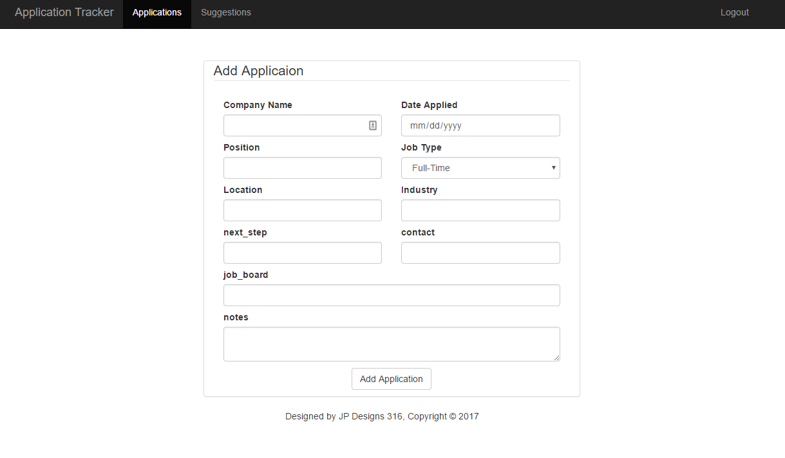
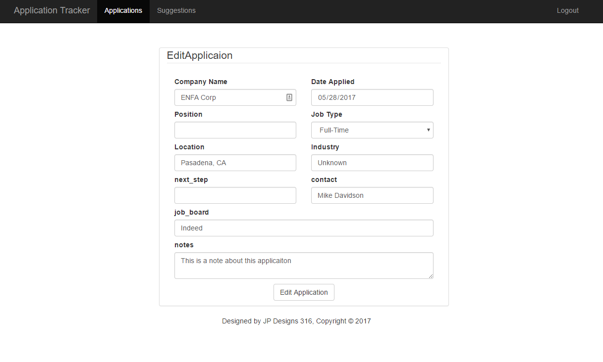

# Application tracker

## Example Screenshots

Add Application Screen:

Edit Application Screen:

List of Application Screen:

## Installation

These are instructions to deploy onto an Amazon EC2 server is listed in EC2_Configuration.MD

## About this application

Python Modules used:
* _Flask_ - This is the web framework this web application is built on.
* _SQLAlchemy_ - This is the chosen Object Relational Mapping module. It is used to create the models and with the help of Blueprints create the routes to the different pages.
* _Flask_WTF_ - This is used in conjunction with wtforms to help make templates of the creation of forms.

## Explanation of file

This application uses and MVC framework.

`__init__` or `app.py` - This is the main code that is used to run the servers.
`models.py` - Contains information about the creation of the database.
`views.py` - This file contains different Blueprints as the routes to the different parts of the website.
`controllers.py` - These are the some of the basic controlling functions to run the application.

Templates directory
`addApply.html` an `editApply.html` - These files contain the forms that are to be used to add or edit an application.
`addSuggest.html` - These files contain the forms that are to be used to add a suggestion for a place to apply.
`macros.html` - This file contains the information about the creation of different macros to help create the forms.
`login.html` - This is the form that is used to login to add application. The only account that is to be logged in can be modified in `config.py`
`applications.html` - This is used to create a listing of all the applications.
`suggestions.html` - This is used to create a listing the suggestions.
`moreInfo.html` - This file is used to give more information about the different things that are listed in the Applications model.
`index.html` - This is the main html setup for the webpage. All other html files 'extend' off this file, with the exception of the html_dependencies, and macro files.
`html_dependencies.html` - These are the html dependencies that have information about the CSS and JS links.

TODO List
* Create a way to search applications by dates.
* Add more functionality and parameters used in the creation of the different applications
